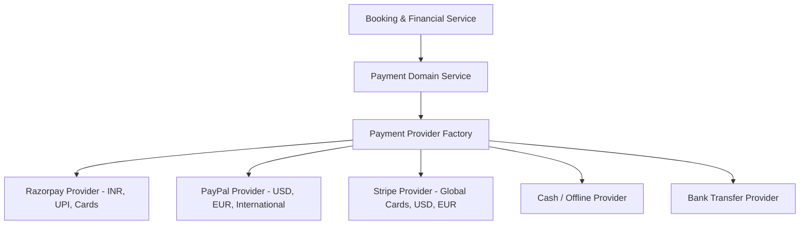

# Enterprise Payment Gateway & Financial Management Module Architecture & Technical Specification

Multi-tenant SaaS Payment Gateway & Financial Management Backend Module (BookMyShow / Eventbrite Style) built with **Node.js, Express.js, Prisma ORM, MongoDB/PostgreSQL, Zod, JWT, Strategy Pattern (Payment Provider Architecture), and Clean Architecture**.

---

## 🏗️ 1. Directory & Folder Structure

All code for this module is isolated inside `src/modules/payment/`:

```text
src/
└── modules/
    └── payment/
        ├── controllers/
        │   ├── payment.controller.js
        │   ├── razorpay.controller.js
        │   ├── paypal.controller.js
        │   ├── refund.controller.js
        │   ├── invoice.controller.js
        │   └── settlement.controller.js
        ├── services/
        │   ├── payment.service.js
        │   ├── refund.service.js
        │   ├── webhook.service.js
        │   ├── invoice.service.js
        │   ├── settlement.service.js
        │   └── currency.service.js
        ├── providers/
        │   ├── paymentProvider.interface.js
        │   ├── paymentProvider.factory.js
        │   ├── razorpay.provider.js
        │   ├── paypal.provider.js
        │   ├── stripe.provider.js
        │   ├── cash.provider.js
        │   └── bankTransfer.provider.js
        ├── repositories/
        │   ├── payment.repository.js
        │   ├── refund.repository.js
        │   ├── invoice.repository.js
        │   └── settlement.repository.js
        ├── routes/
        │   ├── payment.routes.js
        │   ├── razorpay.routes.js
        │   ├── paypal.routes.js
        │   ├── webhook.routes.js
        │   ├── refund.routes.js
        │   ├── invoice.routes.js
        │   └── settlement.routes.js
        ├── validations/
        │   └── payment.validation.js
        ├── dto/
        │   └── payment.dto.js
        ├── middleware/
        │   └── webhookSignatureGuard.middleware.js
        ├── webhooks/
        │   ├── razorpayWebhook.handler.js
        │   └── paypalWebhook.handler.js
        ├── invoices/
        │   └── invoiceGenerator.util.js
        ├── settlements/
        │   └── payoutCalculator.util.js
        ├── utils/
        │   └── signatureVerifier.util.js
        ├── payment.controller.js
        ├── payment.service.js
        ├── payment.repository.js
        ├── refund.service.js
        ├── webhook.service.js
        └── index.js
```

---

## 🔌 2. Strategy Pattern Payment Provider Architecture

The module uses an enterprise **Provider Factory Architecture** allowing seamless integration of new payment gateways (Razorpay, PayPal, Stripe, PhonePe, Cashfree, PayU, Adyen, Apple Pay, Google Pay) without modifying core booking business logic.



### Provider Selection Rule Logic
```text
Event Currency == "INR"  ---> Preferred Gateway: Razorpay (Fallback: Cash/UPI)
Event Currency == "USD"  ---> Preferred Gateway: PayPal / Stripe
Event Currency == "EUR"  ---> Preferred Gateway: Stripe / PayPal
```

---

## 🔄 3. Complete End-to-End Booking & Payment Integration Workflow

```text
[Booking Created] ---> [Reservation Locked (15m)] ---> [Create Payment Order]
                                                             |
                                                             v
[Release Inventory & Expire] <--- (Payment Failed/Expired) <--- [Customer Pays Gateway]
                                                             |
                                                             v
[Generate QR Ticket] <--- [Booking CONFIRMED] <--- [Webhook / Signature Verification]
```

1. **Order Creation**: Client calls `POST /api/payments/create-order` with `bookingId` & optional `gateway`.
2. **Provider Dispatch**: `PaymentProviderFactory` selects provider, validates currency support, and creates gateway order.
3. **Webhook / Callback Verification**: Webhook handler receives notification, verifies HMAC-SHA256 signature, updates payment status to `Paid`.
4. **Idempotency Guard**: Idempotency key prevents double-processing if webhooks are retried.
5. **Booking Confirmation**: On payment success, booking updates to `Confirmed` and QR tickets are generated.

---

## 💵 4. Supported ISO-4217 Multi-Currency Matrix

Supports 20 ISO-4217 currency codes:
- **`INR`**: Indian Rupee (Razorpay / Cash)
- **`USD`**: US Dollar (PayPal / Stripe)
- **`EUR`**: Euro (Stripe / PayPal)
- **`GBP`**: British Pound (Stripe / PayPal)
- **`CAD`**, **`AUD`**, **`SGD`**, **`AED`**, **`SAR`**, **`JPY`**, **`CNY`**, **`HKD`**, **`MYR`**, **`THB`**, **`NZD`**, **`CHF`**, **`SEK`**, **`NOK`**, **`DKK`**, **`ZAR`**.

---

## 🔐 5. PCI-Aware Security & Signature Verification

### PCI-DSS Compliance
- **No Card Data Storage**: Card numbers, CVVs, and expiry dates are **NEVER stored or logged**.
- Store only gateway reference tokens (`gatewayOrderId`, `gatewayPaymentId`, `gatewayTransactionId`).

### HMAC Signature Verification Algorithm (Razorpay Example)
$$\text{Generated Signature} = \text{HMAC-SHA256}(\text{gatewayOrderId} + "|" + \text{gatewayPaymentId}, \text{SecretKey})$$
$$\text{Assert: Generated Signature} == \text{Razorpay Signature Header}$$

---

## 🌐 6. RESTful API Catalogue

### 1. Payment Core APIs
- `POST /api/payments/create-order`: Create payment order with auto-selected provider.
- `POST /api/payments/verify`: Securely verify payment signature & confirm booking.
- `GET /api/payments/:paymentId`: Get payment transaction details.
- `GET /api/payments`: List payments (Admin & Organizer filtering).
- `PATCH /api/payments/:paymentId/cancel`: Cancel pending payment order.
- `PATCH /api/payments/:paymentId/fail`: Mark payment as failed.
- `PATCH /api/payments/:paymentId/expire`: Mark payment order as expired.

### 2. Provider-Specific Gateway APIs
- **Razorpay**:
  - `POST /api/payments/razorpay/create-order`
  - `POST /api/payments/razorpay/verify-signature`
  - `POST /api/payments/razorpay/capture`
- **PayPal**:
  - `POST /api/payments/paypal/create-order`
  - `POST /api/payments/paypal/capture-order`
  - `POST /api/payments/paypal/authorize`

### 3. Webhook Receiver APIs (Public Endpoints with Signature Guard)
- `POST /api/webhooks/razorpay` (Handles `payment.authorized`, `payment.captured`, `payment.failed`, `refund.processed`)
- `POST /api/webhooks/paypal` (Handles `PAYMENT.CAPTURE.COMPLETED`, `PAYMENT.CAPTURE.DENIED`, `PAYMENT.CAPTURE.REFUNDED`)

### 4. Refund Engine APIs
- `POST /api/refunds`: Process full or partial refund (Admin & Organizer).
- `GET /api/refunds`: List processed refunds.
- `GET /api/refunds/:refundId`: Get refund details.

### 5. Automated Tax Invoice & Settlement APIs
- `GET /api/invoices/:bookingId`: Download tax invoice (PDF / Data breakdown with GST/VAT).
- `GET /api/organizer/settlements`: Organizer payout settlement dashboard (Net payout = Gross Revenue - Platform Fee - Commission - Taxes).

---

## 📜 7. Standard API Response Formats

### Success Response
```json
{
  "success": true,
  "message": "Payment order created successfully",
  "data": {
    "paymentId": "65c3ab12ef4512001a89bcde",
    "gateway": "RAZORPAY",
    "gatewayOrderId": "order_N891238910",
    "amount": 2999.00,
    "currency": "INR"
  }
}
```

### Error Response
```json
{
  "success": false,
  "message": "Payment verification failed. Invalid signature",
  "errors": [
    {
      "field": "signature",
      "message": "HMAC signature mismatch"
    }
  ],
  "statusCode": 400
}
```
